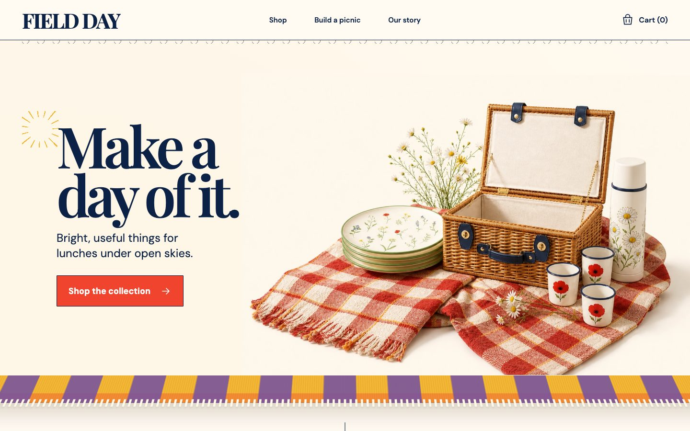

# Awesome Sites in ChatGPT 

Live websites and applications published with Sites in ChatGPT, paired with traceable prompt provenance or an explicit availability status.

**[Explore the visual gallery →](https://awesome-chatgpt-sites.pyth0nb3st.chatgpt.site/)**

> [!IMPORTANT]
> This MVP was scaffolded with AI assistance. Every seed entry and description is pending the [documented human review](docs/human-review-checklist.md); the list does not yet satisfy the upstream Awesome requirement that a list be human-created.

## Contents

- [Featured](#featured)
- [Creative Tools](#creative-tools)
- [Data Visualization](#data-visualization)
- [Ecommerce and Storefronts](#ecommerce-and-storefronts)
- [Education and Documentation](#education-and-documentation)
- [Games](#games)
- [Interactive Experiences](#interactive-experiences)
- [Marketing Sites](#marketing-sites)
- [Internal Apps and Dashboards](#internal-apps-and-dashboards)

## Featured

  
  
  

<strong>Glass Towers · Material Lab · Field Day</strong>

Preview thumbnails are shown for identification and link directly to each live Site. See the [source and rights record](media/previews/README.md).

## Creative Tools

- [AI Crawler Checker](https://actionsignal-readiness.unitedideas.chatgpt.site/ai-crawler-checker) - A public utility that explains how selected AI crawler tokens resolve against a website's robots.txt rules. Prompt not publicly available.
- [Biome Lab](https://interactive-studies-56.openai.chatgpt.site/biome-lab/) - Procedural terrarium sandbox with adjustable ecosystems, with [prompt and provenance](https://developers.openai.com/showcase/biome-lab).
- [Material Lab](https://interactive-studies-56.openai.chatgpt.site/material-lab/) - Real-time 3D tool for testing materials, lighting, forms, and local presets, with [prompt and provenance](https://developers.openai.com/showcase/material-lab).
- [Quietscape Wallpapers](https://quietscape-wallpapers.kameari999.chatgpt.site/) - A bilingual gallery of free personal-use phone wallpapers organized around quiet landscapes, cozy rooms, rainy windows, and night scenes. Prompt not publicly available.
- [Sumi](https://sumi-ascii.wmoto-ai.chatgpt.site/) - A local image-to-ASCII terminal with live resolution, color, charset, and multi-format copy controls. Prompt not publicly available.
- [THE COLD BAR](https://icedcoffee.overboming.chatgpt.site/) - An interactive recipe calculator that models coffee strength, melt, temperature, and serving volume across several brewing presets. Prompt not publicly available.

## Data Visualization

- [Terrain Mixer](https://interactive-studies-56.openai.chatgpt.site/terrain-mixer/) - Procedural landscape generator with synchronized three-dimensional and analytical views, with [prompt and provenance](https://developers.openai.com/showcase/terrain-mixer).
- [Waveform Studio](https://interactive-studies-56.openai.chatgpt.site/waveform-studio/) - Local-first tool for turning audio into customizable visual waveforms, with [prompt and provenance](https://developers.openai.com/showcase/waveform-studio).

## Ecommerce and Storefronts

- [Field Day](https://store-fronts-56.openai.chatgpt.site/field-day/) - Picnic-supply storefront with a product catalog, gift-basket builder, and local cart, with [prompt and provenance](https://developers.openai.com/showcase/field-day).
- [Kiln](https://store-fronts-56.openai.chatgpt.site/kiln/) - Ceramics storefront with an interactive glazed cup and product catalog, with [prompt and provenance](https://developers.openai.com/showcase/kiln).
- [Scent Cartography](https://store-fronts-56.openai.chatgpt.site/scent-cartography/) - Botanical fragrance storefront with a build-your-own scent atelier, with [prompt and provenance](https://developers.openai.com/showcase/scent-cartography).

## Education and Documentation

- [AI Video Class Workshop](https://ai-video-class-workshop.cri-ai-tive.chatgpt.site/) - A Korean guided workshop that turns a fictional-travel idea into a visual storyboard, key images, generation prompts, and a ten-step production checklist. Prompt not publicly available.
- [Anthropic X OpenAI Timeline](https://anthropic-openai-fight.cmedeiro.chatgpt.site/) - An arcade-styled timeline that presents recent Anthropic and OpenAI announcements as dated side-by-side events with a live status panel. Prompt not publicly available.
- [Bathroom Installation Heights Guide](https://guide-hauteurs-salle-de-bains.edifisgroup.chatgpt.site/) - A French-language installation reference with searchable bathroom dimensions, accessibility notes, configurable measurements, site mode, and a printable view. Prompt not publicly available.
- [BYO-UI](https://byo-ui.beershake.chatgpt.site/) - An evidence-linked field guide to buying maintained SaaS foundations while designing task-specific interfaces around real work. Prompt not publicly available.
- [Citation Reality Check](https://citationcheck.yskiyak.chatgpt.site/) - A privacy-minded citation checker that compares a pasted reference list against scholarly metadata without sending the list to a server. Prompt not publicly available.
- [Challenge Atlas](https://challenge-atlas.mathlawguy.chatgpt.site/) - A researched field guide to facial and as-applied constitutional challenges, organized around doctrine, cases, remedies, and litigation framing. Prompt not publicly available.
- [ForcePrep](https://forceprep-salesforce-interviews.adityakumawat-salesf.chatgpt.site/) - A searchable Salesforce interview-preparation workspace with role paths, scenarios, quizzes, code examples, and mock-practice prompts. Prompt not publicly available.
- [PureTap Guide](https://puretap-frizzlife-guide.sedrati.chatgpt.site/) - An independent Frizzlife research site organized around installation spaces, model comparisons, replacement filters, and disclosed discount links. Prompt not publicly available.
- [SIGNAL / AI](https://signal-ai-digest-jp.ddatank1627.chatgpt.site/) - A Japanese editorial digest that turns primary-source AI updates into reviewed signals about models, agents, creative work, and safety. Prompt not publicly available.
- [Strangely Useful](https://wonderledger.x0vvier.chatgpt.site/) - A multi-section discovery magazine covering technology, culture, security, hidden history, useful ideas, entertainment, and quizzes. Prompt not publicly available.
- [The Infinite Build](https://the-infinite-build.openai.chatgpt.site/) - Prompt-first guide for developing and iterating long-running Codex game projects, with [prompt and provenance](https://the-infinite-build.openai.chatgpt.site/).
- [TruthTube Files](https://truthtube-investigations.micheldavidbr.chatgpt.site/) - A magazine-style investigation site organized around case files, scam briefings, protective guidance, videos, and searchable archives. Prompt not publicly available.

## Games

- [Backroom Center: Corrupted](https://backroom-center-corrupted.openai.chatgpt.site/) - First-person exploration game with a procedurally streamed data-center maze and VHS effects, with [prompt and provenance](https://developers.openai.com/showcase/backroom-center-corrupted).
- [Buzz Game Lab](https://buzz-game-lab.sora-jp.chatgpt.site/) - A Japanese collection of free, no-sign-up mobile mini-games built around short challenges, rapid number growth, and repeatable score loops. Prompt not publicly available.
- [Codex Pet Arena](https://codex-pet-arena-20260709.openai.chatgpt.site/) - A fast, colorful platform arena where animated pets collect tokens, grow, and bonk their rivals, with [prompt and provenance](https://developers.openai.com/showcase/codex-pet-arena).
- [Dailies](https://dailies.jonabrams.chatgpt.site/) - A collection of browser logic games including Net, Thermometers, Slant, and Light Up, with optional sign-in for syncing progress. Prompt not publicly available.
- [Glass Towers](https://glass-towers.openai.chatgpt.site/) - Physics-based browser game for stacking translucent forms on a pedestal, with [prompt and provenance](https://developers.openai.com/showcase/glass-towers).
- [MaboMabo](https://mabomabo.lucianlamp.chatgpt.site/) - A Japanese matching-puzzle game built around four-spirit chains, fever mode, burst attacks, and a leaderboard. Prompt not publicly available.
- [MiniTown](https://minitown-cozy-sim.openai.chatgpt.site/) - A tiny living town where zones grow, residents commute, and warm lights come on at night, with [prompt and provenance](https://developers.openai.com/showcase/minitown).
- [Paper Glider](https://paper-glider-56.openai.chatgpt.site/) - Three-dimensional arcade flying game through procedurally generated sunlit rooms, with [prompt and provenance](https://developers.openai.com/showcase/paper-glider).
- [Pechipechi Awake](https://pechipechi-awake.neneneai.chatgpt.site/) - A Japanese pixel-art survival game with a tap-to-start flow, 360-degree movement, three characters, and an endless battle loop. Prompt not publicly available.
- [Phantasy Codex Adventure](https://phantasy-codex-adventure.openai.chatgpt.site/) - A persistent retro action RPG with procedural worlds, classes, bosses, and shared rankings, with [prompt and provenance](https://developers.openai.com/showcase/phantasy-codex-adventure).
- [Phantasy Codex Online](https://phantasy-codex-online.openai.chatgpt.site/) - Persistent browser action role-playing game with classes, physical loot, towns, fixed-level biomes, and escalating world tiers, with [prompt and provenance](https://the-infinite-build.openai.chatgpt.site/).
- [Tiny Blockworld](https://tiny-blockworld.diegocabezas01.chatgpt.site/game/) - A playable voxel sandbox for exploring, building, and breaking a tiny world with six block types. Prompt not publicly available.
- [Tiny Rails Rollercoaster](https://sol-on-rails.openai.chatgpt.site/) - Three-dimensional coaster simulator with eight routes and multiple driving modes, with [prompt and provenance](https://developers.openai.com/showcase/tiny-rails-rollercoaster).
- [方境 / Cubewild](https://fangjing-voxel-71026.xiaohaoyopt0.chatgpt.site/) - A browser-based 3D voxel sandbox with creative mode, procedural textures, and local autosave. Prompt not publicly available.

## Interactive Experiences

- [BRON](https://bron-savana.akdok.chatgpt.site/) - A bilingual, wordless savanna action webcomic with seven episodes, story notes, and accessible text summaries. Prompt not publicly available.
- [Polymarket APR](https://polymarket-apr.neverlack.chatgpt.site/) - A focused comparison tool that estimates annualized returns for similar Polymarket positions and places them alongside a stablecoin yield reference. Prompt not publicly available.
- [Sekai Shift Support](https://sekai-shift-support.bellrin1220.chatgpt.site/) - A Japanese event-support tool that collects availability and team compositions, then generates shareable shifts without requiring contributors to sign in. Prompt not publicly available.
- [SilentButSpiritual](https://silentbutspiritual.silentbutspiritual.chatgpt.site/) - An editorial community site that combines independent music, reflective writing, tarot requests, and a sign-in-gated discussion area. Prompt not publicly available.
- [Sunshine Coast Weekend Gig Guide](https://sunshine-coast-weekend-gig-guide.lukehawleyau.chatgpt.site/) - A filterable weekend planner for markets, live music, arts, family events, and local experiences across the Sunshine Coast, Noosa, and Gympie. Prompt not publicly available.

## Marketing Sites

- [GTA Bee & Wasp Removal](https://gta-bee-wasp-removal.whole-song-6290.chatgpt.site/) - A local pest-control service site with species-specific treatment pages, service-area guidance, direct calling, and same-day availability information. Prompt not publicly available.
- [John Barton Signal Room](https://john-barton-signal-room.jmbarton.chatgpt.site/) - A narrative portfolio that routes visitors by intent and supports its operator and product positioning with case studies, measurable outcomes, and current work. Prompt not publicly available.
- [Richard's Terminal](https://richard-terminal.richardqz.chatgpt.site/) - An interactive product-manager portfolio where terminal commands reveal current focus, project index, background, and contact paths. Prompt not publicly available.

## Internal Apps and Dashboards

- [Hawa Najd Sheet AI](https://hovernage-sheet-ai.najdlogistics.chatgpt.site/) - A multilingual logistics-payroll workspace for turning rider spreadsheets into summaries, Saudi VAT invoices, attendance reports, and exportable workbooks. Prompt not publicly available.
- [InboxPolicy Send Decisions](https://inboxpolicy-send-decisions.sorcerai.chatgpt.site/) - An interactive policy simulator for turning email-verification evidence into bounded send decisions for AI agents. Prompt not publicly available.
- [ScopeSignal](https://scopesignal-freelance-tool.remy999.chatgpt.site/) - An interactive freelance pricing calculator that turns project inputs into a quote range and copyable scope summary. Prompt not publicly available.
- [SurfTracker](https://surftracker-beta.willting.chatgpt.site/) - An Apple Watch-first surfing tracker beta for waves, paddles, speed, GPS routes, and heart rate. Prompt not publicly available.

## Contributing

Read the [contribution guidelines](contributing.md) before proposing a site. One site per pull request, please.

## Footnotes

This is an independent community project and is not affiliated with or endorsed by OpenAI. OpenAI, ChatGPT, and related marks belong to their respective owner. Third-party sites, prompts, and assets retain their original rights unless explicitly stated otherwise. See [third-party notices](THIRD_PARTY_NOTICES.md).
